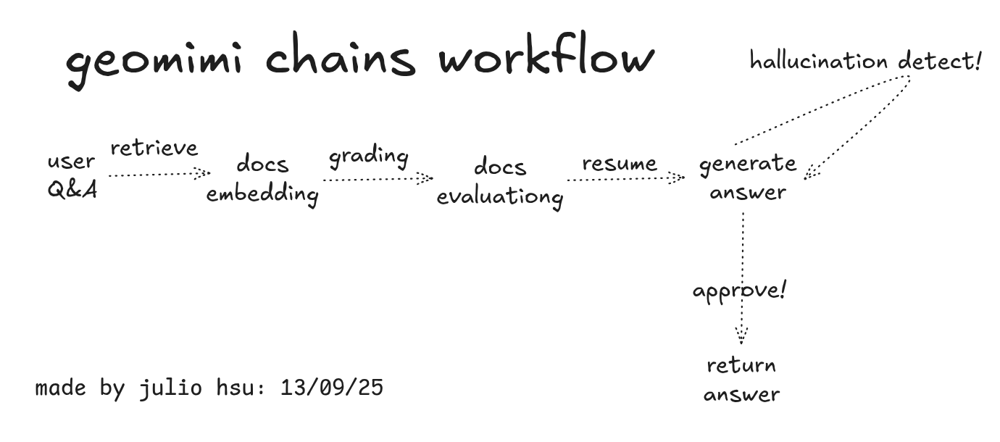

# 🌎 Geomimi – Assistente Inteligente de Cálculos Hidrológicos Avançados de Geografia

[](https://www.python.org/downloads/)
[](https://opensource.org/licenses/MIT)
[](https://streamlit.io/)
[](https://github.com/langchain-ai/langgraph)
[](https://python.langchain.com/)
[](https://www.trychroma.com/)
[](https://www.python.org/dev/peps/pep-0008/)

Esta é uma aplicação web BRASILEIRA - CÓDIGO ABERTO fundada por "Julio Hsu" e seus colaboradores que permite fazer perguntas sobre Geografia do Brasil e conteúdo relacionado. É construída com LangGraph, Streamlit e ChromaDB. Se seu documento não contém a resposta, busca automaticamente online para ajudá-lo.

Este projeto demonstra como construir um sistema RAG (Retrieval-Augmented Generation) usando LangGraph para gerenciamento de fluxo de trabalho. O LangGraph ajuda a orquestrar as diferentes etapas do pipeline RAG, desde o processamento de documentos até a geração de respostas, com tratamento de erros integrado e gerenciamento de estado.

Se você quer entender como o LangGraph funciona com sistemas RAG, esta implementação mostra padrões práticos para construir aplicações de perguntas e respostas sobre documentos com orquestração adequada de fluxo de trabalho.

## Como Funciona

_Link do Vídeo Demo do nosso app: https://www.loom.com/share/75cde0cc4820449bbf9580479d4fa1fb_

Aqui está o que acontece quando você usa esta aplicação e o processo é realmente bem direto:



_Este diagrama mostra como tudo funciona junto nos bastidores._

---

## Implementação LangGraph RAG

Este projeto mostra como implementar RAG com LangGraph de forma prática. O LangGraph lida com a orquestração do fluxo de trabalho, gerenciando as diferentes etapas como recuperação de documentos, verificação de relevância e geração de respostas.

### Por que LangGraph para RAG?

- **Gerenciamento de Estado**: LangGraph gerencia o estado da aplicação conforme ela passa por diferentes etapas de processamento
- **Lógica Condicional**: O fluxo de trabalho pode decidir se deve buscar documentos ou ir online baseado no que encontra
- **Tratamento de Erros**: Mecanismos integrados para lidar com falhas e tentar abordagens alternativas
- **Extensibilidade**: Fácil de adicionar novas etapas ou modificar o fluxo de trabalho conforme necessário

### Principais Padrões LangGraph RAG Usados:

- Avaliação de documentos antes da geração de respostas
- Roteamento condicional entre diferentes métodos de busca
- Validação multi-etapa e verificações de qualidade
- Transições de estado com recuperação adequada de erros

Se você quer aprender implementação LangGraph RAG, esta base de código fornece um exemplo funcional completo com padrões do mundo real.

---

## Tipos de Arquivos que Suportamos

Você pode fazer upload destes tipos de arquivos:

- **Arquivos de Texto**: `.txt`
- **Documentos PDF**: `.pdf`
- **Microsoft Word**: `.docx`
- **Arquivos Excel**: `.csv`, `.xlsx`

---

## Como Funciona

A aplicação funciona em alguns passos simples, mas há processamento complexo acontecendo nos bastidores:

1. **Quando Você Faz uma Pergunta**:

   - Você digita sua pergunta na caixa de texto
   - O app verifica se sua pergunta faz sentido
   - Ele busca através dos seus documentos carregados para encontrar informações relevantes
   - Múltiplas verificações acontecem para garantir que a resposta será boa

2. **Obtendo Sua Resposta**:

   - A aplicação olha o que encontrou nos seus documentos
   - Se há informação relevante, ela escreve uma resposta baseada nisso
   - Ela realiza verificações de qualidade para garantir que a resposta não é fabricada

3. **Garantindo que Tudo Funciona Adequadamente**:

   - A aplicação tem vários pontos de verificação para capturar problemas
   - Ela pode identificar quando uma resposta pode estar incorreta ou fabricada
   - Se um método não funciona, ela tenta outra abordagem
   - Você sempre sabe de onde sua resposta se originou

4. **Avaliação e Transparência**:

   - Após gerar uma resposta, o sistema fornece métricas de avaliação detalhadas
   - Mostra pontuações de relevância de documentos e quais documentos foram mais úteis
   - Exibe qualidade de correspondência pergunta-resposta e classificações de completude
   - Fornece níveis de confiança e raciocínio para cada avaliação
   - Indica se busca online foi usada ou se as respostas vieram dos seus documentos
   - Todos os dados de avaliação são apresentados em tabelas fáceis de ler para total transparência

5. **Vendo o que está Acontecendo** (Opcional):
   - Se você configurar o LangSmith, pode ver exatamente o que o app está fazendo
   - Ótimo para entender o processo ou corrigir problemas
   - Mostra informações de tempo e performance

### Arquitetura LangGraph RAG

O fluxo de trabalho usa LangGraph para gerenciar todo o pipeline RAG:

- **Gerenciamento de Estado**: Todos os dados fluem através de um GraphState definido que rastreia perguntas, documentos e resultados de avaliação
- **Roteamento Condicional**: O sistema decide se deve usar busca de documentos ou busca online baseado no que encontra
- **Recuperação de Erros**: Se a busca de documentos falha, o fluxo de trabalho automaticamente tenta busca online
- **Validação Multi-Etapa**: Cada etapa inclui verificações de qualidade antes de passar para o próximo estágio
- **Design Extensível**: Fácil de adicionar novas etapas de avaliação ou modificar a lógica do fluxo de trabalho

Esta implementação LangGraph RAG fornece uma boa base para construir sistemas de processamento de documentos mais complexos.

---

## O que Você Vai Precisar

Antes de começar, certifique-se de ter essas coisas:

- **Python 3.11 ou mais novo** - [Baixe aqui](https://www.python.org/downloads/)
- **Git** - [Baixe aqui](https://git-scm.com/downloads)
- **Chave API OpenAI** - Você precisa disso para fazer o LLM funcionar
- **Chave API LangSmith** - Apenas se você quiser ver os detalhes do fluxo de trabalho (opcional)

---

## Começando

### Passo 1: Baixar o Código

```bash
git clone https://github.com/juliohsu/geomimi.git
cd geomimi
```

### Passo 2: Configurar um Ambiente Virtual

Isso mantém tudo organizado e não vai interferir com seus outros projetos Python.

**Se você está no Mac ou Linux:**

```bash
python3 -m venv geomimi
source geomimi/bin/activate
```

**Se você está no Windows:**

```bash
python -m venv geomimi
geomimi\Scripts\activate
```

### Passo 3: Instalar Tudo que Você Precisa

Isso instala todos os pacotes necessários:

```bash
pip install --upgrade pip
pip install -r requirements.txt
```

### Passo 4: Adicionar Suas Chaves API

Crie um arquivo chamado `.env` na pasta principal e adicione suas chaves API:

````env
OPENAI_API_KEY=your_openai_api_key_here
LANGCHAIN_API_KEY=your_langsmith_api_key_here
```env
OPENAI_API_KEY=your_openai_api_key_here
LANGCHAIN_API_KEY=your_langsmith_api_key_here
LANGCHAIN_TRACING_V2=true
LANGCHAIN_PROJECT=Advanced-RAG-LangGraph
````

### Passo 5: Iniciar o App

```bash
streamlit run app.py
```

Seu navegador vai abrir automaticamente em `http://localhost:8501`

---

## Guia de Início Rápido

1. **Pergunte à Vontade**: Digite sua pergunta e clique em "Perguntar"
2. **Obtenha Sua Resposta**: Você verá a resposta (Se a pergunta não estiver relacionada ao pdf, não retornará as respostas desejadas pelo usuário)

## Como Usar

### O Básico

1. **Iniciar o App**:

   ```bash
   streamlit run app.py
   ```

   Então vá para `http://localhost:8501` no seu navegador

2. **Mudar o pdf e outros conteúdos**:

   - Procure pela pasta 'local_data'
   - Mude seu pdf ou mesmo outros arquivos de formato

3. **Fazer Perguntas**:
   - Digite sua pergunta na caixa de texto
   - Clique em "Perguntar" ou apenas pressione Enter
   - Verifique sua resposta

---

## Licença

Este projeto usa a Licença MIT - verifique o arquivo [LICENSE](LICENSE) para os detalhes.
